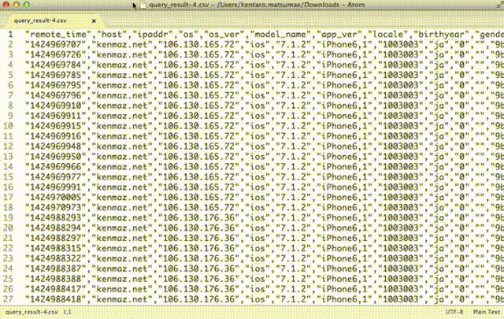

# unixtime-convert package
Convert unixtime to readable datetime format

Notice: This package just detects 9-digits of numbers as unixtime and convert to formatted datetime string. 

A large amount of misdetection will occurs.

**But this is enough for me**.
